# Predict Customer Churn with Clean Code

Project **Predict Customer Churn with Clean Code** of the<br/>
**Machine Learning DevOps Engineer Nanodegree**<br/>
https://classroom.udacity.com/nanodegrees/nd0821

## Installation

If you are using the conda environment MLDO_PCC, you should deactivate it and
remove it.

```
conda deactivate
conda env remove -n MLDO_PCC
```

Create a fresh conda environment MLDO_PCC and activate it:

```
conda create --name MLDO_PCC python=3.6
conda activate MLDO_PCC
```

Install all the required software in the file [requirements.txt](requirements.txt):

```
python -m pip install --upgrade pip setuptools wheel
python -m pip install --no-cache-dir -r requirements.txt
```

Download this repository in your hard disk. So, you can use it.

## Project Description

The project `Predict Customer Churn with Clean Code` does the following pipeline:
- Loading the bank data file.
- Performing the Exploratory Data Analysis (EDA).
- Performing feature engineering.
- Training models
- Doing grid search over many random forest models.
- Saving models.
- Doing classification reports.
- Drawing feature importance plots.
- Drawing ROC curves.

Moreover, this project is a great opportunity to practice the principles of
clean code taught in the course. The code follows the PEP8 standards, is 
well documented, and is covered by test cases that guarantee its good behavior.

**What Is Churn Rate?**<br/>
https://www.investopedia.com/terms/c/churnrate.asp

The churn rate, also known as the rate of attrition or customer churn, is the rate at which customers stop doing business with an entity. It is most commonly expressed as the percentage of service subscribers who discontinue their subscriptions within a given time period. It is also the rate at which employees leave their jobs within a certain period. For a company to expand its clientele, its growth rate (measured by the number of new customers) must exceed its churn rate.

## Directory Structure

```
$ tree --dirsfirst .
.
├── data
│   └── bank_data.csv
├── images
│   ├── eda
│   │   ├── churn_distribution.png
│   │   ├── correlation_heatmap.png
│   │   ├── customer_age_distribution.png
│   │   ├── marital_status_distribution.png
│   │   └── total_transaction_distribution.png
│   └── results
│       ├── lr_classification_report.png
│       ├── lr_roc_curve.png
│       ├── rf_classification_report.png
│       ├── rf_feature_importances.png
│       ├── rf_roc_curve.png
│       ├── rf_shap_feature_importances.png
│       └── roc_curves.png
├── logs
│   └── churn_library.log
├── models
│   ├── logistic_model.pkl
│   └── rfc_model.pkl
├── churn_library.html
├── churn_library.py
├── churn_notebook.ipynb
├── churn_script_logging_and_tests.html
├── churn_script_logging_and_tests.py
├── constants.py
├── generate_documentation.sh
├── Guide.ipynb
├── pylint_all_python_scripts.sh
├── README.md
└── requirements.txt

6 directories, 27 files
```

## Running Files

You can run the files by using these 2 commands:

```
ipython churn_library.py
ipython churn_script_logging_and_tests.py
```

By running `ipython churn_library.py`, it is expected to see these results:

```
$ ipython churn_library.py 
Fitting 5 folds for each of 12 candidates, totalling 60 fits
[CV 1/5] END criterion=gini, max_depth=5, max_features=auto, n_estimators=200; total time=   1.4s
...
[CV 5/5] END criterion=entropy, max_depth=100, max_features=auto, n_estimators=500; total time=   6.9s
SUCCESS! Total Execution time: 6 minutes 44.59 seconds.
```

By running `ipython churn_script_logging_and_tests.py`, it is expected to see these results:

```
$ ipython churn_script_logging_and_tests.py 

...
----------------------------------------------------------------------
Ran 22 tests in 571.373s

OK
```

## Auto PEP8

You can autoformat the Python scripts with these 2 commands:

```
autopep8 --in-place --aggressive --aggressive churn_script_logging_and_tests.py
autopep8 --in-place --aggressive --aggressive churn_library.py
```

## PEP8 Scores

You can score the cleanliness of your code with these 2 commands:

```
pylint churn_library.py 
pylint churn_script_logging_and_tests.py
```

You can run the 2 commands with the script `pylint_all_python_scripts.sh`.
And it is expected to see these results:

```
$ sh pylint_all_python_scripts.sh 
pylint churn_library.py

--------------------------------------------------------------------
Your code has been rated at 10.00/10 (previous run: 10.00/10, +0.00)

pylint churn_script_logging_and_tests.py

--------------------------------------------------------------------
Your code has been rated at 10.00/10 (previous run: 10.00/10, +0.00)
```

## pydoc

You can generate the documentation of the code with these 2 commands:

```
pydoc -w churn_library
pydoc -w churn_script_logging_and_tests
```

You can run the 2 commands with the script `generate_documentation.sh `.
And it is expected to see these results:

```
$ sh generate_documentation.sh 
IPython could not be loaded!
wrote churn_library.html
IPython could not be loaded!
wrote churn_script_logging_and_tests.html
```

You can read the documentation by clicking in these 2 links:
- [churn_library.html](churn_library.html)
- [churn_script_logging_and_tests.html](churn_script_logging_and_tests.html)

## Images of the Exploratory Data Analysis (EDA)

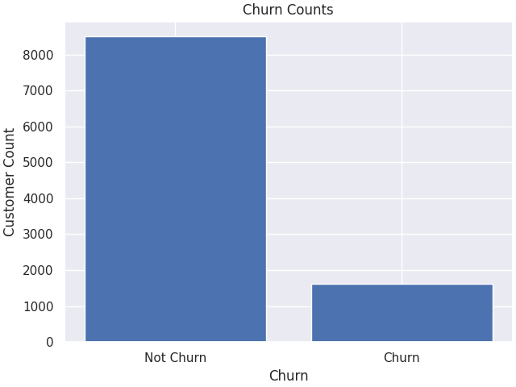

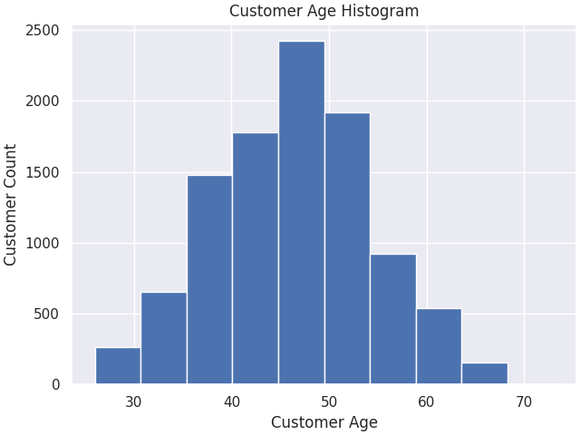

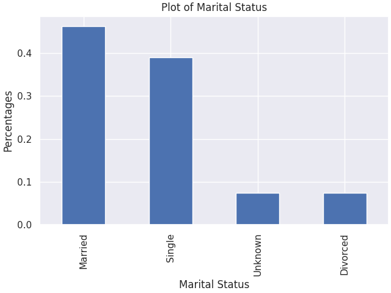

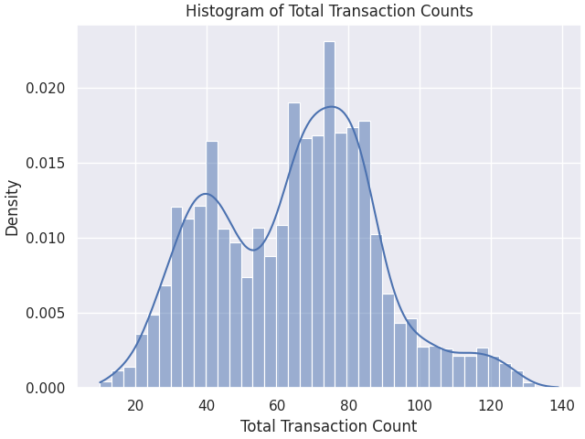

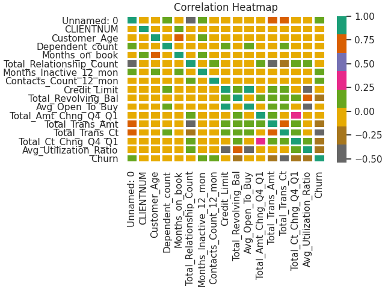

## Images of the results after training the models

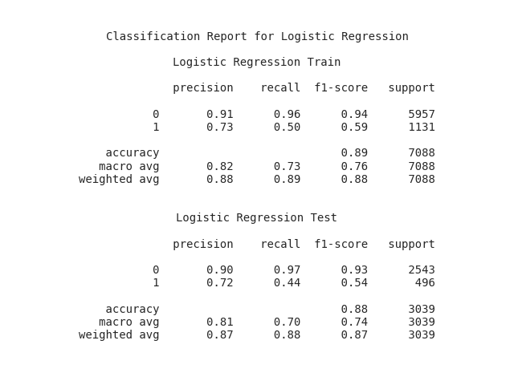

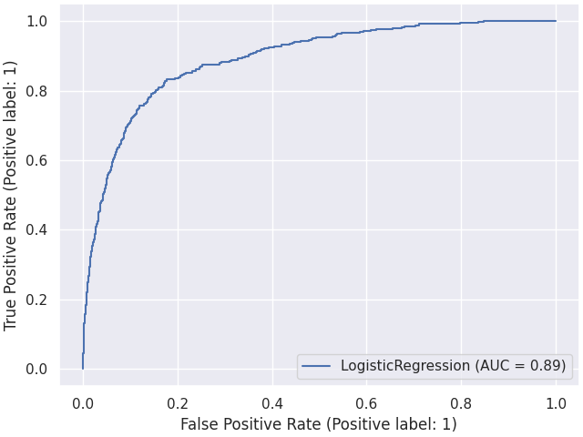

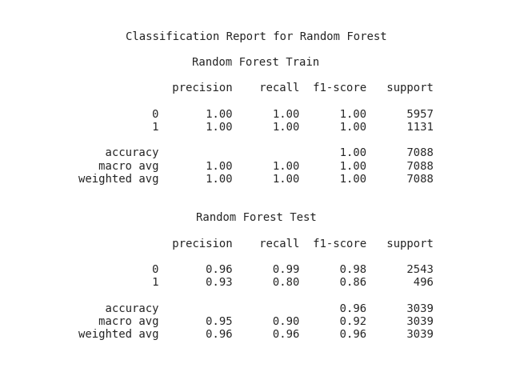

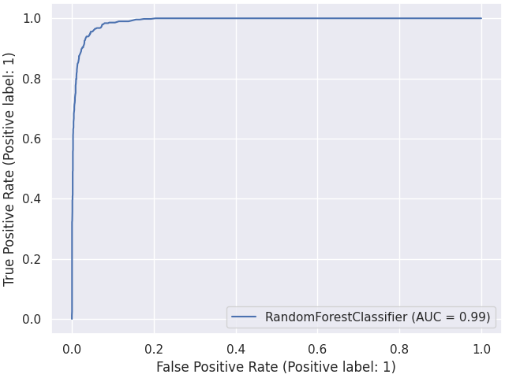

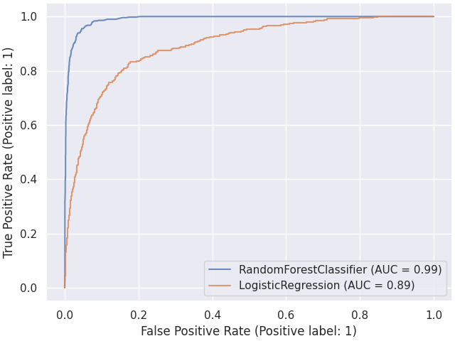

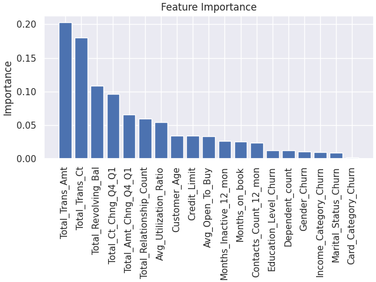

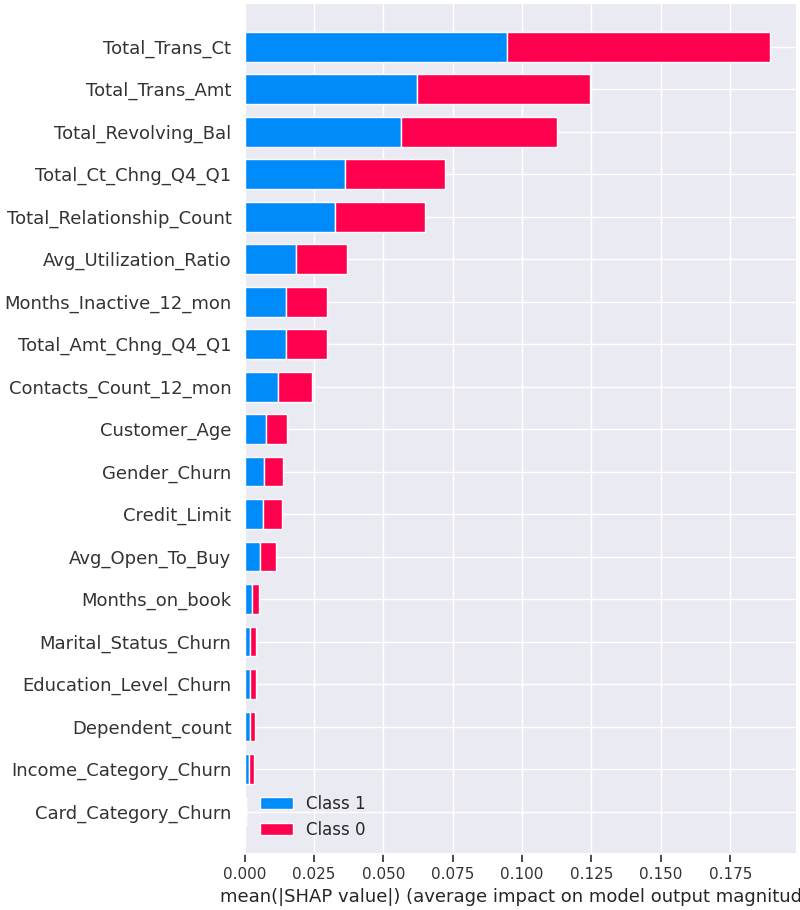

